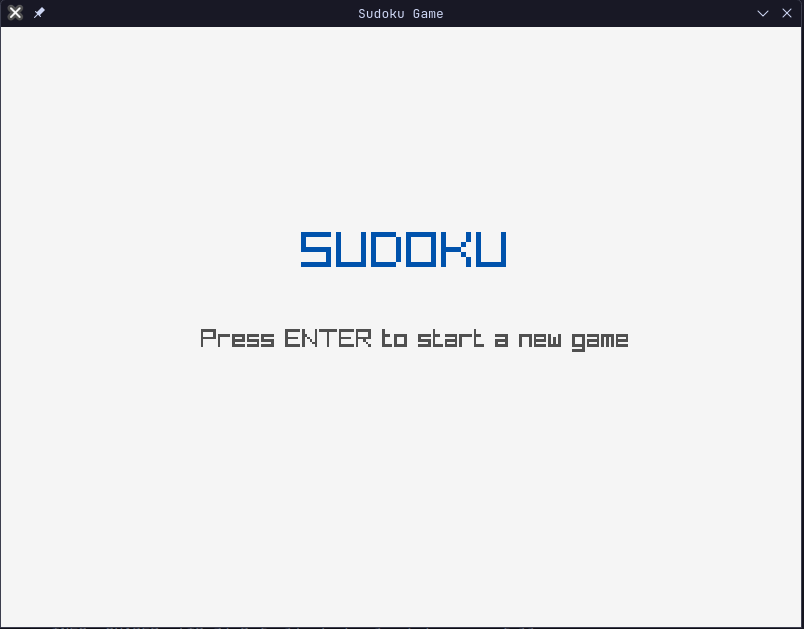
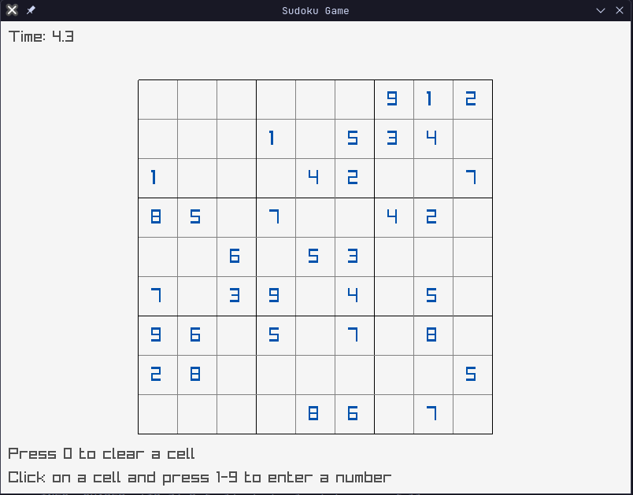

# Sudoku Game

A C++ implementation of the classic Sudoku puzzle game using the raylib graphics library.

## Overview

This Sudoku game provides a complete implementation with:
- Multiple difficulty levels (Easy, Medium, Hard)
- Clean, modular OOP design with well-documented code
- Visual game board with interactive cells
- Game timer to track solving speed
- Menu and game completion screens
- Error handling with try-catch blocks

## Project Structure

The project is organized as follows:

```
sudoku/
├── include/            # Header files
│   ├── Game.h          # Main game class
│   ├── GameTypes.h     # Common game types and constants
│   ├── SudokuBoard.h   # Sudoku board logic
│   └── UIManager.h     # UI rendering
├── src/                # Source files
│   ├── Game.cpp        # Game implementation
│   ├── SudokuBoard.cpp # Board implementation
│   └── UIManager.cpp   # UI implementation
├── main.cpp            # Entry point
└── CMakeLists.txt      # Build configuration
```

## Dependencies

- [raylib](https://www.raylib.com/) - A simple and easy-to-use library to learn videogames programming

## Building

### Prerequisites

- C++11 compatible compiler
- CMake 3.10 or higher
- raylib library installed on your system

### Build Instructions

This project uses CMake for building:

```bash
# Create build directory
mkdir -p build
cd build

# Configure and build the project
cmake ..
make

# Run the game
./sudoku
```

## Gameplay Instructions

1. Press ENTER on the menu screen to start a new game
2. Click on an empty cell to select it
3. Press a number key (1-9) to place a number in the selected cell
4. Press 0 or DELETE to clear a cell
5. Complete the puzzle by filling all cells with the correct numbers

## Code Structure

- **Game Class**: Main game controller that manages the game loop and state
- **SudokuBoard Class**: Handles board logic, validation, and game mechanics
- **UIManager Class**: Manages rendering of UI elements and different screens
- **GameTypes.h**: Contains common types, enums, and constants used throughout the game

## Screenshots

Here are some screenshots of the game in action:





## Future Enhancements

- Sudoku puzzle generator (currently uses a test board)
- Difficulty selection in the menu
- Saving/loading game state
- Hint system
- Cell notes/candidates
- Undo/redo functionality
- Timer pause functionality
- Keyboard navigation between cells

## Development

The project uses a CMake-based build system and follows modern C++ practices. The code is documented using Doxygen-style comments.

### Adding New Features

1. Fork the repository
2. Create a feature branch (`git checkout -b feature/amazing-feature`)
3. Commit your changes (`git commit -m 'Add some amazing feature'`)
4. Push to the branch (`git push origin feature/amazing-feature`)
5. Open a Pull Request

## License

This project is licensed under the [GNU General Public License v3.0](LICENSE) - see the [LICENSE](LICENSE) file for details.

This means you are free to:
- Use, study, and modify the software
- Share the software and your modifications
- Distribute copies of the software

With the requirement that:
- You must license derivatives under the same license
- You must disclose the source code
- You must state changes made to the code
- You must include the license and copyright notice
